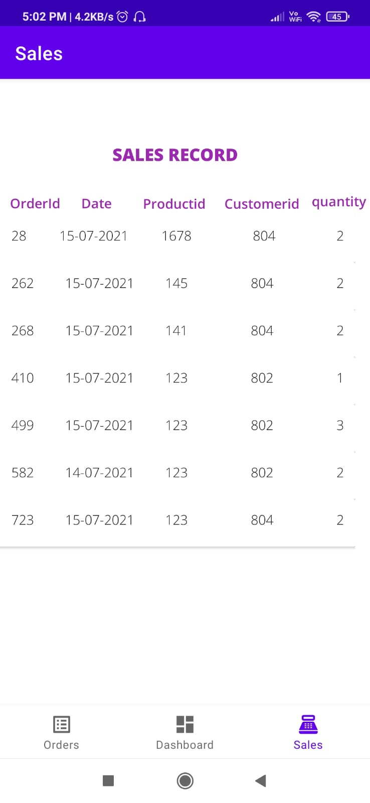
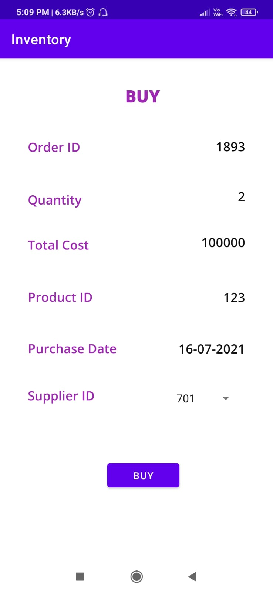
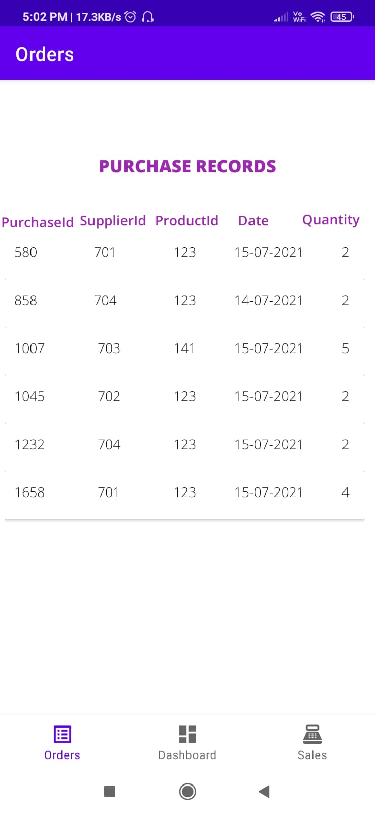
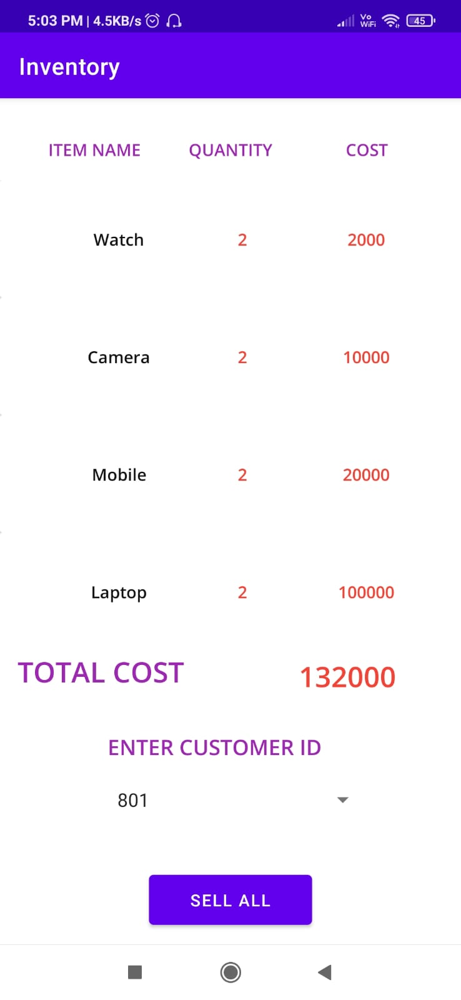

# InventoryManager
An Android App to manage all 
# ScreenShots
| | | |
| DashBoard Screen | Sales | Buying Window |
| |||
| Orders | Inventory |
| ||

# Backend
(MySQL Workbench)
All SQL commands are provided in the SQL Queries File Above.
