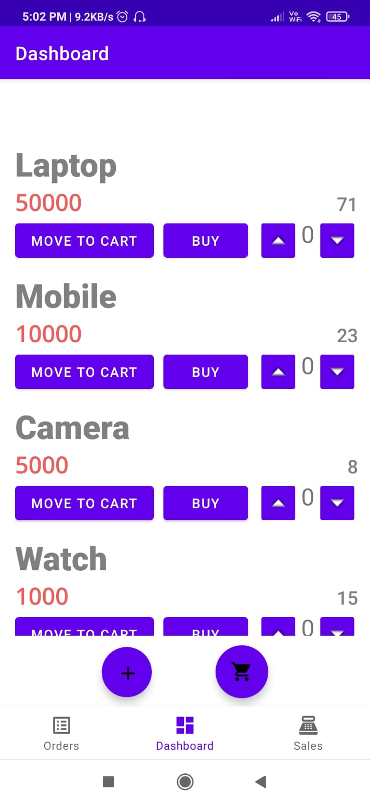

# InventoryManager
An Android App to manage all 
# ScreenShots
| | | |
|---|---|---|
|Login Window|User Choice Window|
| |||
|||
| ||

# Backend
(MySQL Workbench)
All SQL commands are provided in the SQL Queries File Above.
